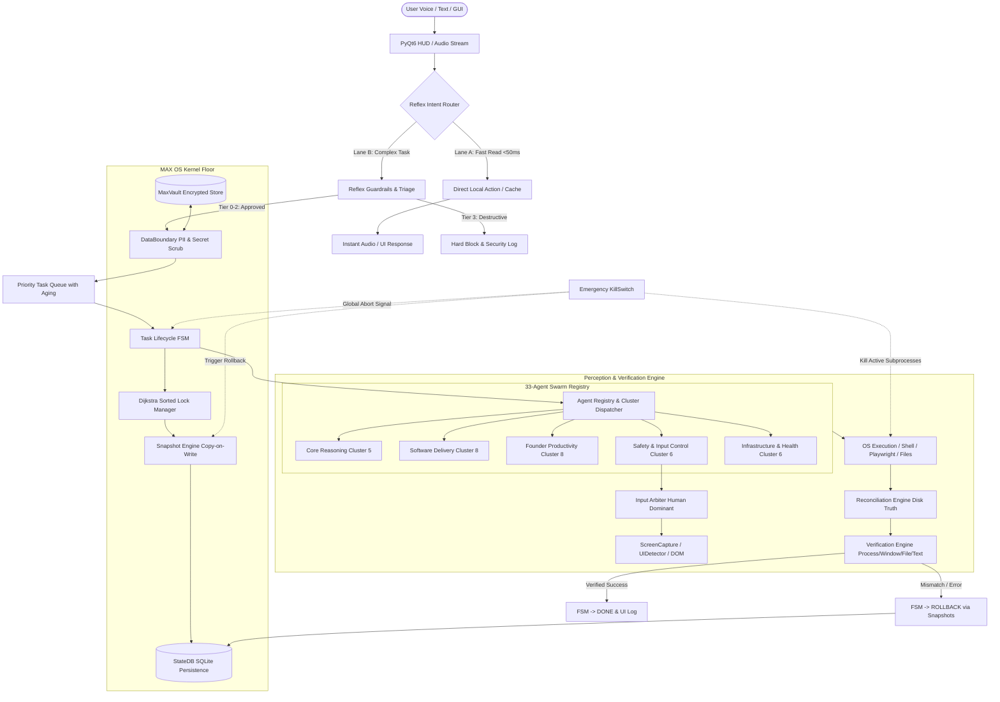

# ⚙️ CyberBlack AI-agent MAX 
### The Ultimate High-Reliability Autonomous Desktop Agent Swarm & Voice AI
#### Built and Developed by CyberBlack

[](https://www.python.org/)
[](#)
[](#)
[](#)
[](LICENSE)

---

## 📑 Table of Contents
1. [Executive Overview](#-executive-overview)
2. [Complete System Architecture](#-complete-system-architecture)
   - [Architectural Blueprint](#architectural-blueprint)
   - [Dual-Lane Processing Model](#1-dual-lane-processing-model)
   - [LAYA Reflex Engine](#2-laya-reflex-engine)
   - [MAX OS Kernel & Infrastructure Floor](#3-max-os-kernel--infrastructure-floor)
   - [Memory Context Heap & Token Budgeting](#4-memory-context-heap--token-budgeting)
   - [The 33-Agent Swarm (5 Clusters)](#5-the-33-agent-swarm-5-clusters)
   - [Perception & Verification Engine](#6-perception--verification-engine)
   - [User Interface & Remote Control](#7-user-interface--remote-control)
3. [Safety, Guardrails & Human-in-the-Loop](#-safety-guardrails--human-in-the-loop)
4. [Step-by-Step Quick Start](#-step-by-step-quick-start)
5. [Configuration & Key Storage](#-configuration--key-storage)
6. [Testing & Verification Guide](#-testing--verification-guide)
7. [Repository File Map](#-repository-file-map)
8. [License & Attribution](#-license--attribution)

---

## 🌟 Executive Overview

**CyberBlack AI-agent MAX** is a real-time, voice-first autonomous desktop operating environment powered by **Gemini 3.1 Flash Live**, the **LAYA Reflex Engine**, and the **MAX OS Kernel**. It transforms standard personal computers into intelligent, proactive, self-healing workstations.

Unlike conventional chatbots or brittle desktop scripts, CyberBlack AI-agent MAX operates as a fault-tolerant **33-Agent Swarm** that perceives screen state, reasons over multi-step workflows, acquires deadlock-free resource locks, captures copy-on-write snapshots, executes autonomous code and desktop actions, and deterministically reconciles real operating system truth before marking any task as complete.
---

## ⚡ Step-by-Step Quick Start

### Prerequisites
- **OS**: Windows 10/11, macOS, or Linux.
- **Python**: Version **3.11** or **3.12** installed and on your PATH.
- **Hardware**: Working microphone and speakers.

### 1. Clone the Repository
```bash
git clone https://github.com/ANONYMOUSworld112/MAX-AGENT.git
cd MAX-AGENT
```

### 2. Run Automated Setup
The smart installer automatically detects your operating system, configures required directories, installs Python packages with OS-specific filtering, provisions Playwright browser binaries, and validates COM registration:

```bash
python setup.py
```


### 3. Launch CyberBlack AI-agent MAX
```bash
python main.py
```

### 4. First-Time Configuration
1. On first launch, the configuration window appears.
2. Enter your free **Gemini API Key** (obtainable from [Google AI Studio](https://aistudio.google.com/)).
3. Pick your preferred microphone and speakers from the measured device picker.
4. *(Optional)* Enable **Wake Word ("Hey MAX")** in ⚙ → WAKE WORD for 100% local hands-free activation.

---


### Core Breakthroughs
- ⚡ **Dual-Lane Routing**: Sub-50ms reflex path for local instant queries vs. fully orchestrated autonomous swarm lane for complex work.
- 🛡️ **Zero-Compromise Guardrails**: 4-Tier safety gate that permanently blocks destructive operations (`rmdir /s /q C:\Windows\System32`, `dd`, `format`) and requires unforgeable human UI confirmation for power and network changes.
- 🔄 **Copy-on-Write Rollback**: Every file modification is snapshotted before execution. If an agent errors or the emergency KillSwitch is tripped, the system rolls back cleanly without data loss.
- 🔒 **Dijkstra Sorted Locking**: Multi-resource locking ordered by string sort keys eliminates deadlock across concurrent sub-agents.
- 🎯 **Ground-Truth Reconciliation**: Tasks are not declared `DONE` merely because an LLM said so. The `ReconciliationEngine` and `VerificationEngine` verify file existence, byte size, hash digests, exit codes, and UI DOM states on disk.

---

## 🏛 Complete System Architecture

### Architectural Blueprint



---

### 1. Dual-Lane Processing Model

The system implements a dual-path pipeline in `core/reflex/intent_router.py`:

- **Lane A (Reflex Fast Path — Sub-50ms)**:
  - Bypasses the heavy agent queue and background thread coordination.
  - Used for read-only system queries (CPU/RAM telemetry, active window title), volume/brightness adjustments, application launching, and immediate conversational acknowledgments.
  - Guarantees instant latency without waiting for multi-agent consensus.

- **Lane B (Autonomous Swarm Lane)**:
  - Enters the priority task queue with starvation aging.
  - Coordinates multi-agent planning, AST code manipulation, database queries, web scraping, and deep research.
  - Full lifecycle enforcement: locking, snapshotting, circuit breaker monitoring, and post-execution verification.

---

### 2. LAYA Reflex Engine

Located in `core/reflex/`, the LAYA subsystem handles immediate cognitive triage:

- **`LayaReflexEngine`**: High-performance decision-making core using deterministic boolean evaluation and urgency weighting.
- **`ReflexIntentRouter`**: Classifies raw natural language input into Lane A vs. Lane B, detects mutating operations, and maps tasks to prioritized urgency bands.
- **`ReflexGuardrails`**: Four distinct risk tiers:
  - **Tier 0 (Safe Read)**: Telemetry, status queries, file reading.
  - **Tier 1 (Safe Write)**: Scratch files, workspace document creation, logs.
  - **Tier 2 (Confirm on Write)**: Overwriting existing source code, installing packages, editing system configurations.
  - **Tier 3 (Hard Block)**: Absolute intercept of catastrophic commands (e.g., `rmdir /s /q C:\Windows\System32`, `dd if=/dev/zero`, disk formatting, privilege tampering).
- **`TriageEngine`**: Assigns dynamic priority (Band 0 Critical, Band 1 High, Band 2 Normal, Band 3 Low, Band 4 Background) with automatic anti-starvation age boosting.

---

### 3. MAX OS Kernel & Infrastructure Floor

Located in `core/max_infra/`, this layer acts as the operating system kernel for autonomous execution:

- **`TaskLifecycleFSM`**: Strict 10-state deterministic state machine preventing illegal state jumps:
  $$\text{CREATED} \rightarrow \text{QUEUED} \rightarrow \text{LOCK\_WAIT} \rightarrow \text{SNAPSHOT} \rightarrow \text{RUNNING} \rightarrow \text{RECONCILING} \rightarrow \text{VERIFYING} \rightarrow \text{DONE}$$
  With fail-safe paths: `ROLLING_BACK`, `FAILED`, and `CANCELLED`.
- **`LockManager`**: Implements Dijkstra resource ordering. Multi-file or multi-resource requests are sorted lexicographically before acquisition, mathematically guaranteeing that circular wait deadlocks cannot occur.
- **`SnapshotEngine`**: Prior to any file write or overwrite, copies original file state to `.snapshots/<task_id>/`. Enables exact instant rollbacks if any verification check fails.
- **`ReconciliationEngine`**: Audits operating system truth against agent declarations. Confirms on-disk existence, non-zero file sizes, and shell exit codes ($0$).
- **`KillSwitch`**: Hardware/software emergency halt. Instantly kills registered sub-processes and active threads, trips all running tasks into `CANCELLED`, and triggers immediate snapshot reversion.
- **`StateDB`**: Thread-safe SQLite engine storing task state, transition history, priority levels, and audit logs.
- **`MaxVault`**: AES-256 encrypted credential store keeping API tokens, OAuth keys, and passwords secure with environment variable fallback.
- **`DataBoundary`**: Automatically detects and replaces sensitive information (API keys, passwords, credit card numbers, emails) with reversible tokens (`[REDACTED_API_KEY_1]`) before prompts enter LLM context.
- **`CircuitBreaker` & `Watchdog`**: Detects hanging tasks, infinite agent loops, and repeated errors, automatically terminating runaway sub-agents and enforcing cooldown periods.

---

### 4. Memory Context Heap & Token Budgeting

Located in `core/memory/`:

- **`MemoryContextHeap`**: Hierarchical memory model combining:
  1. *Working Memory*: Active task parameters, open window handles, recent tool outputs.
  2. *Episodic Memory*: Multi-turn conversational summaries and recent decisions.
  3. *Persistent Long-Term Memory*: User preferences, project facts, and indexed keys stored in `memory/long_term.json`.
- **`TokenBudgetCompressor`**: Prevents prompt explosion. Dynamically preserves high-value identity facts and structured key indices while compressing older conversational turns using sliding-window summarization.

---

### 5. The 33-Agent Swarm (5 Clusters)

All agents inherit from `BaseAgent` (`agents/base.py`) and adhere to the **OBSERVE $\rightarrow$ THINK $\rightarrow$ ACT $\rightarrow$ VERIFY** operational cycle. Registered in `agents/router.py`:

```
                       ┌──────────────────────────────┐
                       │     AgentRegistry (Router)   │
                       └──────────────┬───────────────┘
         ┌──────────────┬─────────────┼──────────────┬──────────────┐
         ▼              ▼             ▼              ▼              ▼
   Core Reasoning   Software      Founder        Safety &       Infrastructure
    Cluster (5)    Delivery (8)  Productivity (8) Input (6)       & Health (6)
```

#### Cluster 1: Core Reasoning (5 Agents)
- **`MasterOrchestrator`**: Decomposes high-level requests and coordinates multi-agent dependencies.
- **`DecompositionPlanner`**: Breaks ambiguous goals into atomic, dependency-ordered subtasks.
- **`ValidationVerifier`**: Evaluates task deliverables against formal success criteria.
- **`ModelRouter`**: Selects the optimal LLM backend per subtask based on complexity and speed.
- **`AdversarialCritic`**: Stress-tests plans for edge cases, resource conflicts, and safety risks.

#### Cluster 2: Software Delivery (8 Agents)
- **`CodingAgent`**: Code synthesis, AST refactoring, and patch generation.
- **`CodeReviewer`**: Security audits, vulnerability screening, and PEP 8 / clean code enforcement.
- **`TestWriter`**: Automated unit test, integration test, and property-based test generation.
- **`DevOpsAgent`**: Docker configuration, CI/CD pipelines, and environment builds.
- **`DBAgent`**: Schema migrations, query optimization, and SQLite integrity audits.
- **`APIDesigner`**: REST/FastAPI endpoint specification and contract design.
- **`DocWriter`**: API documentation, docstrings, and architectural markdown creation.
- **`DependencyMgr`**: Dependency graph auditing and package conflict resolution.

#### Cluster 3: Founder Productivity (8 Agents)
- **`EmailAgent`**: Inbox triage, draft synthesis, and VIP thread summaries.
- **`CalendarAgent`**: Schedule conflict resolution and meeting booking.
- **`CommsAgent`**: Multi-channel communications (Slack, Discord, WhatsApp).
- **`ResearchAgent`**: Deep web search and academic literature synthesis via DuckDuckGo.
- **`FileOrganizer`**: Workspace hygiene, file categorization, and directory taxonomy.
- **`NotesAgent`**: Structured note-taking, markdown summaries, and knowledge base updates.
- **`TaskTracker`**: Sprint tracking, TODO management, and issue backlog maintenance.
- **`MeetingPrep`**: Participant dossiers and contextual briefing generation.

#### Cluster 4: Safety & Input Control (6 Agents)
- **`ComputerUseAgent`**: Vision-guided desktop navigation and multi-step UI control.
- **`DesktopAgent`**: Native window management, process inspection, and window focus.
- **`BrowserAgent`**: Headless DOM extraction and web automation via Playwright.
- **`InputArbiter`**: Hardware arbitration giving absolute priority to human mouse/keyboard inputs.
- **`SecurityGate`**: Prompt injection mitigation and taint analysis.
- **`RecoveryEngine`**: Post-crash recovery, state restoration, and snapshot rollback.

#### Cluster 5: Infrastructure & Health (6 Agents)
- **`SystemMonitorAgent`**: CPU, RAM, GPU, disk, and thermal telemetry.
- **`NetworkAgent`**: Socket reachability, DNS health, and latency monitoring.
- **`BackupAgent`**: Automated state archives and disaster recovery snapshots.
- **`UpdateAgent`**: Package updates and dependency deprecation checks.
- **`PerformanceAgent`**: Latency profiling and execution bottleneck diagnostics.
- **`HealthCheckAgent`**: Comprehensive subsystem health and liveness auditing.

---

### 6. Perception & Verification Engine

Located in `core/perception/` and `core/verification/`:

- **Perception Pipeline**:
  - `ScreenCapture`: Multi-monitor screen capture using fast `mss` buffers.
  - `AccessibilityEngine` & `UIDetector`: Inspects OS window trees via UIAutomation and pywinauto on Windows.
  - `BrowserDOMExtractor`: Extracts semantic DOM node trees for robust web automation.
  - `TextDetector`: Fallback OCR text localization.
  - `StateBuilder`: Fuses visual, accessibility, and focus data into a unified `PerceptionState`.

- **Verification Engine**:
  - Aggregates multi-modal validation reports:
    - `FileVerifier`: Verifies file presence, size > 0, and SHA256 checksums.
    - `ProcessVerifier`: Validates process lifecycle and PID state.
    - `WindowVerifier`: Verifies application window presence and titles.
    - `ElementVerifier`: Confirms UI element state (enabled, visible, clicked).
    - `TextVerifier`: Confirms text appearance on screen or in logs.
    - `StateDiffVerifier`: Validates before-and-after OS state deltas.

---

### 7. User Interface & Remote Control

- **PyQt6 Monochromatic HUD**:
  - Custom dark-mode reactor interface featuring real-time audio waveforms, reactor core visualizer, state badges, activity logs, and settings drawers.
  - `TaskListWidget`: Real-time display of running, pending, and completed tasks from the MAX OS Kernel.
- **Remote Mobile Dashboard**:
  - Built-in FastAPI server with TLS support and QR-code pairing.
  - Access `/api/agents` to monitor all 33 agents and `/api/tasks` for live execution status from your phone or external browser.

---

## 🛡 Safety, Guardrails & Human-in-the-Loop

CyberBlack AI-agent MAX enforces safety at the architectural level:

1. **Unforgeable Confirmation Gate**: Destructive actions (shutdown, restart, toggle WiFi) present an interactive banner on the HUD. The action cannot proceed until the human clicks CONFIRM on the screen.
2. **Input Arbitration**: The `InputArbiter` operates in `HUMAN_DOMINANT` mode. If the user touches the physical mouse or keyboard while an agent is executing a desktop task, the agent's virtual input lease is revoked immediately.
3. **Emergency KillSwitch**: Triggered via voice command, HUD button, or programmatic condition. Halts all active subprocesses and reverts file snapshots.


## 🔐 Configuration & Key Storage

Configuration is saved locally in `config/api_keys.json`, which is strictly git-ignored.
Fresh clones include `config/api_keys.example.json` as a safe template. Copy it to
`config/api_keys.json` only when you need a non-interactive starting configuration,
and never commit real credentials.

```json
{
  "gemini_api_key": "YOUR_GEMINI_API_KEY",
  "os_system": "windows",
  "assistant_name": "MAX",
  "user_name": "Boss",
  "voice_name": "Puck",
  "input_device": "Microphone Array",
  "output_device": "Speakers (Realtek Audio)",
  "wake_word_enabled": true
}
```

Sensitive tokens and secrets stored by agents during runtime are managed by `core/max_infra/vault.py` with AES-256 encryption.

---

## 🧪 Testing & Verification Guide

CyberBlack AI-agent MAX includes an exhaustive test suite covering unit behavior, integration pipelines, and end-to-end daily life user scenarios:


## 🗂 Repository File Map

```
CyberBlack-AI-agent-MAX/
├── main.py                     # Application entry point, Gemini Live audio streaming, dual-lane dispatch
├── ui.py                       # PyQt6 HUD interface, reactive waveform, reactor core, settings drawer
├── setup.py                    # OS-aware automated environment installer & setuptools packaging
├── pyproject.toml              # Modern Python build-system and pytest configuration
├── requirements.txt            # Production dependencies with OS platform markers
├── IMPLEMENTATION_PLAN.md      # Detailed 15-phase architecture & engineering plan
│
├── agents/                     # 33-Agent Autonomous Swarm
│   ├── base.py                 # BaseAgent abstract class with lifecycle guarantees
│   ├── router.py               # AgentRegistry and cluster dispatch engine
│   ├── core/                   # Cluster 1: MasterOrchestrator, DecompositionPlanner, etc.
│   ├── software/               # Cluster 2: CodingAgent, CodeReviewer, TestWriter, etc.
│   ├── productivity/           # Cluster 3: EmailAgent, CalendarAgent, ResearchAgent, etc.
│   ├── safety/                 # Cluster 4: ComputerUseAgent, InputArbiter, SecurityGate, etc.
│   └── infrastructure/         # Cluster 5: SystemMonitorAgent, NetworkAgent, BackupAgent, etc.
│
├── core/                       # Core MAX OS Kernel & Reflex Infrastructure
│   ├── reflex/                 # LAYA Reflex Engine (IntentRouter, Guardrails, Triage)
│   ├── max_infra/              # MAX OS Kernel (FSM, LockMgr, Snapshot, Reconciler, KillSwitch, StateDB, Vault)
│   ├── memory/                 # MemoryContextHeap & TokenBudgetCompressor
│   ├── perception/             # ScreenCapture, UIDetector, AccessibilityEngine, DOMExtractor
│   ├── verification/           # VerificationEngine, FileVerifier, WindowVerifier, ProcessVerifier
│   ├── prompt.txt              # Primary system prompt & tool routing directives
│   ├── undo.py                 # Action reverse journal and undo registry
│   ├── confirm.py              # Unforgeable human-in-the-loop confirmation gate
│   ├── audio_devices.py        # Host-API audio device prober and resolution
│   ├── action_loader.py        # Dynamic action auto-discovery
│   └── wake_word.py            # Local offline openWakeWord engine
│
├── actions/                    # Bundled voice-callable action modules
│   ├── web_search.py           # Multi-mode search (news, research, price, compare)
│   ├── screen_processor.py     # Desktop & webcam vision processor
│   ├── computer_settings.py    # Volume, brightness, Wi-Fi, power control
│   └── ...                     # Additional built-in desktop capabilities
│
├── dashboard/                  # Remote web & mobile dashboard
│   ├── server.py               # FastAPI backend with /api/agents and /api/tasks endpoints
│   └── static/                 # Monochromatic mobile web interface
│
├── ui/                         # UI components
│   └── components/
│       └── task_list_widget.py # HUD widget rendering real-time task queue states
│
└── tests/                      # 83 Automated Tests (100% Pass)
    ├── unit/                   # Unit test suite
    ├── integration/            # Multi-agent & infrastructure integration tests
    └── e2e/                    # End-to-end task flow & daily life scenario validations
```

---

## 📄 License & Attribution

- **License**: Personal and non-commercial use only under [Creative Commons BY-NC 4.0](https://creativecommons.org/licenses/by-nc/4.0/).
- **Created & Developed by**: **CyberBlack** & the **MAX Autonomous Systems Development Team**.

